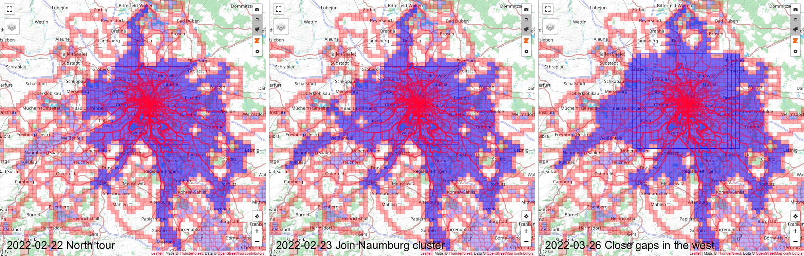

# Tiles in Time
Are you a [VeloViewer](https://veloviewer.com) addict who persistently tries to increase the number of tiles, the maximum square, and the maximum cluster?
It yes, then this project is for you.

The project provides a script that creates screenshots of the VeloViewer *Activities* screen for a given range/list of dates.
Each screenshot gets the date of your activity and an optional title.
All screenshots have exactly the same resolution.
That allows you to create a movie showing how your maximum clusters grows over time (more on that below).



# Modes of Operation
Tiles in Time can take over the entire process: starting Chrome, logging into Strava, preparing the VeloViewer map view, and taking a series of screenshots.
It can also connect to a running Chrome and start from the currently visible.
This allows you to control various visibility parameters such as zoom level.

The mode of operation is defined in the `"mode"` field of the config file (config-file options are described below).
The modes in detail are:
* Mode **1**: Tiles in Time opens a new Chrome window (or connects to an existing Chrome if `"chromePort"` is defined in the config file),
  logs into Strava using the credentials read from the config file,
  opens the _Activities_ tab of VeloViewer,
  prepares the map (in particular chooses the proper zoom level),
  and takes the screenshots.
* Mode **2**: This mode assumes that a Chrome instance is running, and that the _Activities_ tab of VeloViewer is opened.
  It prepares the map and takes the screenshots.
* Mode **3**: In this mode nothing is changed on the map. In particular, the zoom level is kept.
  The _Filters_ bar must be open. Tiles in Time immediately starts taking screenshots.

# Installation
Make sure [Git](https://git-scm.com/downloads) and [Node.js](https://nodejs.org/en/download/) are installed on your computer.

```
$ git clone https://github.com/mouton0815/tiles-in-time.git
$ cd tiles-in-time
$ npm install
$ cp config.json.example config.json
```

* **TODO**: Describe config.json options
* **TODO**: Mention that opening the map toolbar leads to auto-zoom effects; workaround is to go to another tab and then back to 'Activities' 